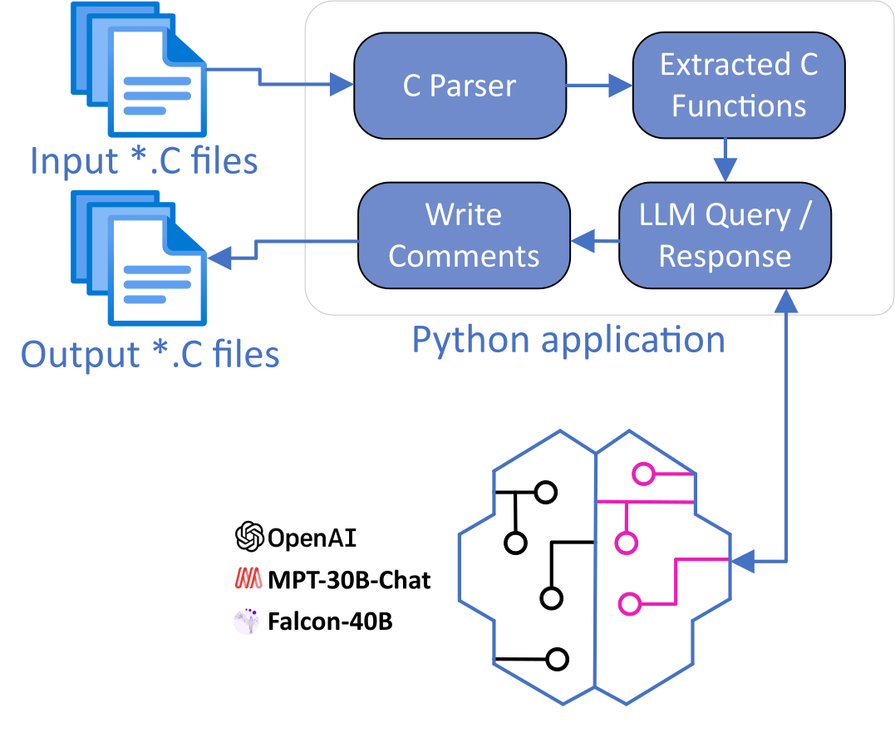

# Generate Doxygen Comments for Code using LLM

## Table of Contents
- [Introduction](#introduction)
- [Prerequisites](#prerequisites)
- [Installation](#installation)
- [How It Works](#how-it-works)

## Introduction

This project provides a simple Python application called `LlmDoxify`, which uses the OpenAI GPT-3 language model (LLM) to generate Doxygen-style comments for C code. LLM, which stands for Language Model by OpenAI, is a powerful AI language model capable of generating human-like text responses.

By utilizing the `LlmDoxify` function, developers can efficiently generate informative and structured Doxygen comments for their C functions, making code documentation easier and more consistent.

## Prerequisites

Before using this tool, ensure that you have the following prerequisites:

1. Python 3.x installed on your system.
2. Access to the OpenAI GPT-3 API (if you plan to use the `LlmDoxify` function).

## Installation

To use the `LlmDoxify` function, you need to perform the following steps:

1. Clone this GitHub repository to your local machine
2. Install the required Python dependencies:
    * pip install -r requirements.txt
3. Obtain access to the OpenAI GPT-3 API and get the API key.

4. Generate Doxygen comments using the `LlmDoxify` function
function_code = """
// Your C function code here...
"""

generated_comment = LlmDoxify(function_code)

## How It Works
The LlmDoxify function utilizes the OpenAI GPT-3 language model (LLM) to generate human-like text responses. It constructs a prompt containing the provided C function code and instructs the language model to generate a Doxygen-style comment based on the input.

Please note that the quality and accuracy of the generated comments depend on the performance of the LLM and the context of the provided C code.

## Here is an example of how to use the LlmDoxify function:

from llm_doxify import LlmDoxify

function_code = """
// Function to calculate the factorial of a positive integer.
int factorial(int n) {
    // Your implementation here...
}
"""

generated_comment = LlmDoxify(function_code)
print(generated_comment)

## Output:

/**
 * @brief Calculate the factorial of a positive integer.
 *
 * This function calculates the factorial of a given positive integer `n`.
 *
 * @param n The positive integer for which the factorial is to be calculated.
 * @return The factorial of the input integer `n`.
 */
